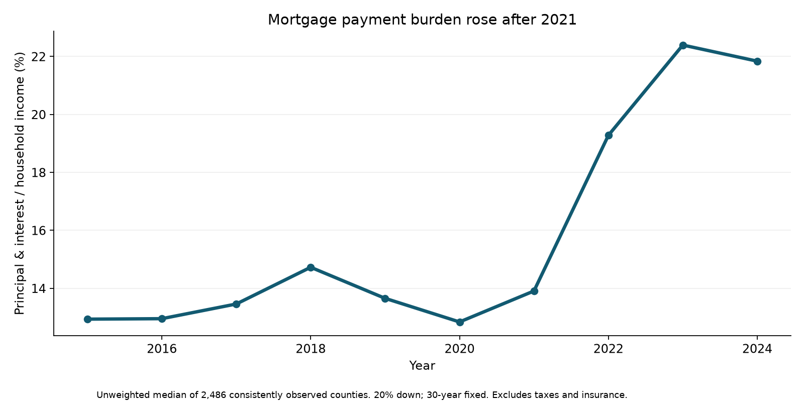

# Mortgage & Housing Affordability Analytics

**How did prices, incomes and mortgage rates change the cost of buying a home?**

The median modeled principal-and-interest payment burden increased from **12.9% to 21.8%** of household income across **2,486 consistently observed counties, 2015–2024**.

Tools: **Python · pandas · NumPy · SQLite · JavaScript · Tableau-ready data**.



## Start here

- Read [the case study](REPORT.md) for findings, method and limitations.
- Run [the notebook](notebooks/housing_affordability_analysis.ipynb) for the workflow.
- Open `housing.sqlite` and run [the SQL queries](sql/analysis_queries.sql).
- Use `data/processed/housing_affordability.csv` in Tableau.
- Review `data/processed/validation.json` and `sql_results.json` for executed checks.

## Reproduction

```sh
python -m pip install -r requirements.txt
python analysis.py
```

Python 3.12 was used. The source snapshots are included, so network access is not needed to rerun the analysis. Public source downloads and SHA-256 hashes are recorded in `data/source_manifest.json`. `download_sources.py` retrieves Census/FRED files when needed; it preserves existing files.

## Results

- Median county growth: home values **77.4%**, income **43.8%**, modeled monthly payment **144.7%**.
- Annual mean mortgage rates: **3.85% → 6.72%**.
- Mean decomposition: prices **+10.87 pp**, rates **+6.14 pp**, income **−7.39 pp**.
- 2025 is a separate housing/rate context, with no invented income estimate.

The ratio models a new purchase at 20% down over 30 years. It excludes taxes, insurance and other ownership costs. Headline statistics are unweighted county summaries, not national household statistics. County rankings are descriptive point estimates.

## Data choices

The supplied Zillow file is preserved. Census SAIPE annual income replaces the initially proposed ACS five-year estimates. Complete monthly housing coverage is required, FIPS joins are audited, and Connecticut geography mismatches are explicitly excluded. See the full report and data dictionary before reusing the results.

## Portfolio use

This project was prepared with AI assistance. Adapt the writing, review the code and describe your own role accurately. `PORTFOLIO_NOTES.md` includes suggested phrasing and a beginner learning sequence. `tableau/README.md` explains how to build a native Tableau dashboard; the published interactive dashboard itself is a web application.

Source data retains its original providers' rights and terms. No blanket license is applied to Zillow data.
